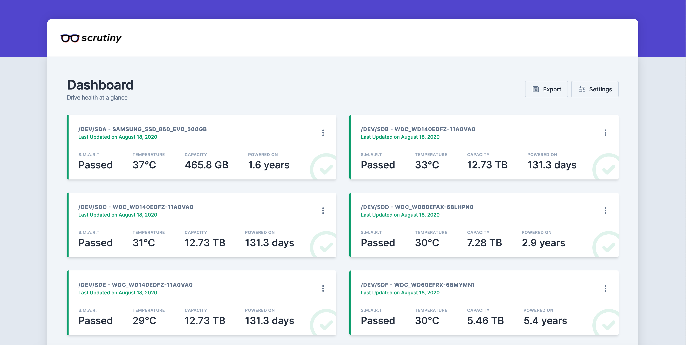

<!--
N.B.: README ini dibuat secara otomatis oleh <https://github.com/YunoHost/apps/tree/master/tools/readme_generator>
Ini TIDAK boleh diedit dengan tangan.
-->

# Scrutiny untuk YunoHost

[](https://ci-apps.yunohost.org/ci/apps/scrutiny/)  

[](https://install-app.yunohost.org/?app=scrutiny)

*[Baca README ini dengan bahasa yang lain.](./ALL_README.md)*

> *Paket ini memperbolehkan Anda untuk memasang Scrutiny secara cepat dan mudah pada server YunoHost.*  
> *Bila Anda tidak mempunyai YunoHost, silakan berkonsultasi dengan [panduan](https://yunohost.org/install) untuk mempelajari bagaimana untuk memasangnya.*

## Ringkasan

**Scrutiny is a Hard Drive Health Dashboard & Monitoring solution, merging manufacturer provided S.M.A.R.T metrics with real-world failure rates.**

> NOTE: Scrutiny is a Work-in-Progress and still has some rough edges.

### Features

Scrutiny is a simple but focused application, with a couple of core features:

- Web UI Dashboard - focused on Critical metrics
- `smartd` integration (no re-inventing the wheel)
- Auto-detection of all connected hard-drives
- S.M.A.R.T metric tracking for historical trends
- Customized thresholds using real world failure rates
- Temperature tracking
- Provided as an all-in-one Docker image (but can be installed manually)
- Configurable Alerting/Notifications via Webhooks
- (Future) Hard Drive performance testing & tracking


**Versi terkirim:** 0.8.1~ynh1

## Tangkapan Layar



## Dokumentasi dan sumber daya

- Dokumentasi admin resmi: <https://github.com/AnalogJ/scrutiny/tree/master/docs>
- Depot kode aplikasi hulu: <https://github.com/AnalogJ/scrutiny>
- Gudang YunoHost: <https://apps.yunohost.org/app/scrutiny>
- Laporkan bug: <https://github.com/YunoHost-Apps/scrutiny_ynh/issues>

## Info developer

Silakan kirim pull request ke [`testing` branch](https://github.com/YunoHost-Apps/scrutiny_ynh/tree/testing).

Untuk mencoba branch `testing`, silakan dilanjutkan seperti:

```bash
sudo yunohost app install https://github.com/YunoHost-Apps/scrutiny_ynh/tree/testing --debug
atau
sudo yunohost app upgrade scrutiny -u https://github.com/YunoHost-Apps/scrutiny_ynh/tree/testing --debug
```

**Info lebih lanjut mengenai pemaketan aplikasi:** <https://yunohost.org/packaging_apps>
