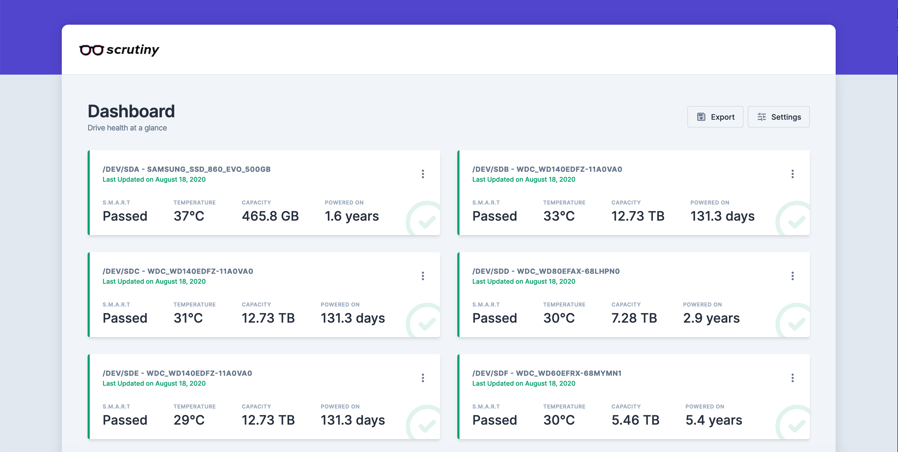

<!--
Важно: этот README был автоматически сгенерирован <https://github.com/YunoHost/apps/tree/master/tools/readme_generator>
Он НЕ ДОЛЖЕН редактироваться вручную.
-->

# Scrutiny для YunoHost

[](https://ci-apps.yunohost.org/ci/apps/scrutiny/)  

[](https://install-app.yunohost.org/?app=scrutiny)

*[Прочтите этот README на других языках.](./ALL_README.md)*

> *Этот пакет позволяет Вам установить Scrutiny быстро и просто на YunoHost-сервер.*  
> *Если у Вас нет YunoHost, пожалуйста, посмотрите [инструкцию](https://yunohost.org/install), чтобы узнать, как установить его.*

## Обзор

**Scrutiny is a Hard Drive Health Dashboard & Monitoring solution, merging manufacturer provided S.M.A.R.T metrics with real-world failure rates.**

> NOTE: Scrutiny is a Work-in-Progress and still has some rough edges.

### Features

Scrutiny is a simple but focused application, with a couple of core features:

- Web UI Dashboard - focused on Critical metrics
- `smartd` integration (no re-inventing the wheel)
- Auto-detection of all connected hard-drives
- S.M.A.R.T metric tracking for historical trends
- Customized thresholds using real world failure rates
- Temperature tracking
- Provided as an all-in-one Docker image (but can be installed manually)
- Configurable Alerting/Notifications via Webhooks
- (Future) Hard Drive performance testing & tracking


**Поставляемая версия:** 0.8.1~ynh1

## Снимки экрана



## Документация и ресурсы

- Официальная документация администратора: <https://github.com/AnalogJ/scrutiny/tree/master/docs>
- Репозиторий кода главной ветки приложения: <https://github.com/AnalogJ/scrutiny>
- Магазин YunoHost: <https://apps.yunohost.org/app/scrutiny>
- Сообщите об ошибке: <https://github.com/YunoHost-Apps/scrutiny_ynh/issues>

## Информация для разработчиков

Пришлите Ваш запрос на слияние в [ветку `testing`](https://github.com/YunoHost-Apps/scrutiny_ynh/tree/testing).

Чтобы попробовать ветку `testing`, пожалуйста, сделайте что-то вроде этого:

```bash
sudo yunohost app install https://github.com/YunoHost-Apps/scrutiny_ynh/tree/testing --debug
или
sudo yunohost app upgrade scrutiny -u https://github.com/YunoHost-Apps/scrutiny_ynh/tree/testing --debug
```

**Больше информации о пакетировании приложений:** <https://yunohost.org/packaging_apps>
